# Rapport de Stage – Développement d'Outils de Gestion

---

**Titre (Anglais) :** Development of Management Tools

**Stagiaire :** Maxence Bonnet  
**Formation :** 1ère Année Ingénieur – Informatique et Cybersécurité (ICS)  
**École :** CPE Lyon  
**Année Universitaire :** 2024–2025

**Entreprise d'accueil :** Natécia (Groupe Noalys)  
**Maître de stage :** Juliette Durousset  
**Période :** [Date de début] – [Date de fin]

**Destinataires :**
*   **Maître de stage :** Juliette Durousset
*   **Tuteur école :** Juliette Durousset
*   **École :** CPE Lyon

**Mots-clés :** Développement applicatif, Flutter, Python, Automatisation de workflow, Intelligence Artificielle

---

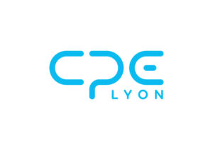

---

## Résumé

Ce rapport présente les travaux réalisés durant mon stage de première année au sein de la clinique Natécia (Groupe Noalys). L'objectif principal de ce stage était d'améliorer et de fluidifier les processus internes de gestion des notes de frais et des demandes de remboursement par la conception et le développement de trois applications logicielles distinctes.

Face à des procédures manuelles chronophages et sources d'erreurs, la mission a consisté à :
1.  **Développer une application mobile multi-plateforme (iOS/Android) en Flutter/Dart** pour permettre aux employés de soumettre leurs notes de frais de manière dématérialisée. L'application intègre une analyse par Intelligence Artificielle (Google Gemini) pour l'extraction automatique des données depuis les justificatifs.
2.  **Adapter cette application pour les dirigeants (PDG)**, avec des fonctionnalités avancées, notamment l'export direct des données vers Google Sheets pour un suivi comptable optimisé.
3.  **Créer une application de bureau en Python** pour la gestion centralisée du workflow de validation des demandes de remboursement de trop-perçus, impliquant plusieurs services (facturation, comptabilité, direction).

Ce rapport détaille la démarche adoptée pour chaque projet, de l'analyse du besoin à la livraison des solutions fonctionnelles. Il expose les choix architecturaux et technologiques (Flutter, Python, SQLite), les défis rencontrés – notamment l'apprentissage en autonomie de nouvelles technologies et l'intégration d'une base de données sur un lecteur réseau – et les résultats obtenus. Les solutions développées ont permis de moderniser les processus, d'améliorer la traçabilité et de réduire significativement le temps de traitement administratif.

---
## Sommaire

- [Résumé](#resume)
- [Introduction](#introduction)
  - [Présentation du Stagiaire](#presentation-du-stagiaire)
  - [Présentation de l'Entreprise : Natécia](#presentation-entreprise-natecia)
  - [Contexte et Enjeux du Stage](#contexte-et-enjeux-du-stage)
  - [Structure du Rapport](#structure-du-rapport)
- [Développement – Chapitre 1 : Application Mobile "Notes de Frais Employé"](#chapitre-1-notes-de-frais-employe)
  - [Analyse du Besoin](#ch1-analyse-du-besoin)
  - [Démarche Adoptée et Solutions Envisagées](#ch1-demarche-et-solutions)
  - [Justification des Choix Techniques](#ch1-choix-techniques)
  - [Fonctionnement de l'Application](#ch1-fonctionnement-application)
    - [Figure 1 : Schéma du workflow](#figure-1-workflow-ndf)
    - [Figure 1.1 : Diagramme de Contexte C4](#figure-1-1-contexte-ndf)
    - [Figure 1.2 : Diagramme de Conteneurs C4](#figure-1-2-conteneurs-ndf)
  - [Fonctions Clés Issues du Code](#ch1-fonctions-cles)
  - [Difficultés Rencontrées](#ch1-difficultes)
  - [Résultats Obtenus](#ch1-resultats)
- [Développement – Chapitre 2 : Application Mobile "Notes de Frais PDG"](#chapitre-2-notes-de-frais-pdg)
  - [Analyse du Besoin Spécifique](#ch2-analyse-specifique)
  - [Adaptations et Fonctionnalités Clés](#ch2-adaptations-fonctionnalites)
  - [Résultats](#ch2-resultats)
- [Développement – Chapitre 3 : Application Desktop "Gestion des Remboursements"](#chapitre-3-gestion-des-remboursements)
  - [Analyse du Besoin](#ch3-analyse-du-besoin)
  - [Architecture Logicielle MVC](#ch3-architecture-mvc)
    - [Figure 2 : Schéma d'architecture](#figure-2-architecture-remb)
    - [Figure 2.1 : Diagramme de Contexte C4](#figure-2-1-contexte-remb)
    - [Figure 2.2 : Diagramme de Conteneurs C4](#figure-2-2-conteneurs-remb)
  - [Fonctions Clés Issues du Code](#ch3-fonctions-cles)
  - [Fonctionnement et Workflow de Validation](#ch3-workflow-validation)
    - [Figure 3 : Diagramme du workflow](#figure-3-workflow-remb)
  - [Gestion de la Base de Données sur Réseau](#ch3-bdd-reseau)
  - [Résultats Obtenus](#ch3-resultats)
- [Conclusion](#conclusion)
  - [Récapitulatif des Livrables](#recapitulatif-des-livrables)
  - [Limites et Perspectives d'Évolution](#limites-et-perspectives)
- [Remerciements](#remerciements)
- [Glossaire](#glossaire)
- [Bibliographie](#bibliographie)
- [Annexes](#annexes)
  - [Liens vers les dépôts de code source](#annexes-liens-depots)
  - [Captures d'écran à insérer](#annexes-captures)

---

## Introduction

### Présentation du Stagiaire

Je suis Maxence Bonnet, un étudiant de 22 ans en première année de cycle ingénieur en Informatique et Cybersécurité (ICS) à CPE Lyon. Mon parcours académique a débuté par un Baccalauréat STI2D spécialité SIN (Systèmes d'Information et Numérique), suivi d'un BTS SNIR (Systèmes Numériques, option Informatique et Réseaux). Cette formation m'a permis d'acquérir de solides compétences en développement logiciel et en administration système, que j'ai souhaité mettre en pratique dans un contexte professionnel concret.

### Présentation de l'Entreprise : Natécia

Natécia est une clinique privée lyonnaise spécialisée dans la santé de la femme, de la mère et de l'enfant. En tant que membre du groupe Noalys, elle s'inscrit dans un réseau d'établissements de santé reconnus pour la qualité de leurs soins. Le stage s'est déroulé au sein du service administratif de la clinique, où un besoin de modernisation des outils informatiques a été identifié pour optimiser les tâches de gestion interne.

<figure>
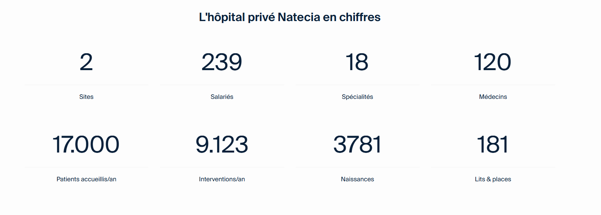
<figcaption>Capture — Présentation visuelle de Natécia (page d'accueil du site ou bâtiment avec logo).</figcaption>
</figure>

### Contexte et Enjeux du Stage

Le point de départ de ce stage était un constat simple : les processus de gestion des notes de frais et des demandes de remboursement étaient majoritairement manuels, reposant sur des échanges d'e-mails et des documents papier. Cette méthode de travail présentait plusieurs inconvénients majeurs :
*   **Perte de temps** pour les employés et les services comptables.
*   **Risques d'erreurs** de saisie et de perte de justificatifs.
*   **Manque de traçabilité** et de vision centralisée sur l'état des demandes.
*   **Processus de validation long** et complexe, impliquant de multiples intervenants.

L'objectif du stage était donc de répondre à ces problématiques en développant des solutions logicielles sur mesure, capables d'automatiser et de sécuriser ces workflows.

### Structure du Rapport

Ce rapport s'articule en trois chapitres principaux, chacun dédié à l'un des projets développés. Nous commencerons par les deux applications mobiles de notes de frais, puis nous aborderons l'application de bureau pour la gestion des remboursements. Chaque chapitre décrira la démarche suivie, les choix techniques effectués et les résultats obtenus. Enfin, une conclusion générale dressera le bilan du stage, ses apports et les perspectives d'évolution des outils créés.

---

## Développement – Chapitre 1 : Application Mobile "Notes de Frais Employé"

### Analyse du Besoin

Le premier projet visait à dématérialiser entièrement le processus de soumission des notes de frais pour les collaborateurs de Natécia. Le cahier des charges fonctionnel était le suivant :
*   Permettre la capture de justificatifs via l'appareil photo ou l'import de fichiers (images, PDF).
*   Extraire automatiquement les informations clés (marchand, date, montant, TVA) grâce à une IA.
*   Permettre à l'utilisateur de vérifier et corriger les données extraites.
*   Gérer les notes de frais kilométriques.
*   Conserver un historique des notes soumises et en attente.
*   Générer un rapport PDF et l'envoyer par e-mail au service comptable avec les justificatifs en pièces jointes.
*   Fonctionner sur iOS et Android.

### Démarche Adoptée et Solutions Envisagées

Face au besoin d'une application multi-plateforme, le choix s'est naturellement porté sur un framework de développement cross-platform. Après étude, **Flutter** a été retenu pour sa performance, son écosystème riche et sa facilité de prise en main.

Pour l'extraction de données, la solution d'une **API d'Intelligence Artificielle** a été privilégiée par rapport à une simple technologie OCR, afin d'obtenir une analyse sémantique du document (catégorisation de la dépense) et un indice de confiance sur les données extraites.

### Justification des Choix Techniques

*   **Langage :** Dart (via Flutter) pour le développement mobile.
*   **Framework UI :** Flutter pour sa capacité à produire des interfaces natives compilées pour iOS et Android à partir d'une seule base de code.
*   **Gestion de l'état :** `Riverpod`, pour une gestion d'état réactive, robuste et scalable.
*   **Analyse IA :** API `Google Gemini`, pour ses capacités avancées en analyse de documents et extraction d'informations structurées.
*   **Stockage local :** Base de données NoSQL `Hive`, très performante et bien intégrée à l'écosystème Flutter, pour stocker l'historique des notes de frais.
*   **Envoi d'e-mails :** Bibliothèque `mailer` pour l'envoi des rapports en tâche de fond.

### Fonctionnement de l'Application

L'application suit un workflow utilisateur simple et intuitif.

#### Figure 1 : Schéma du workflow de l'application "Notes de Frais"
<figure>
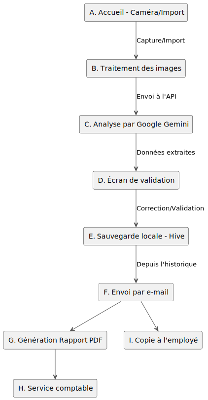
<figcaption>Figure 1 : Schéma du workflow de l'application "Notes de Frais"</figcaption>
</figure>

*Le workflow ci-dessus illustre le parcours d'un justificatif, de sa capture à sa réception par le service comptable.*

#### Figure 1.1 : Diagramme de Contexte C4 de l'application "Notes de Frais"
<figure>
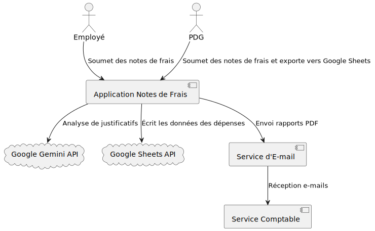
<figcaption>Figure 1.1 : Diagramme de Contexte C4 de l'application "Notes de Frais"</figcaption>
</figure>

#### Figure 1.2 : Diagramme de Conteneurs C4 de l'application "Notes de Frais"
<figure>
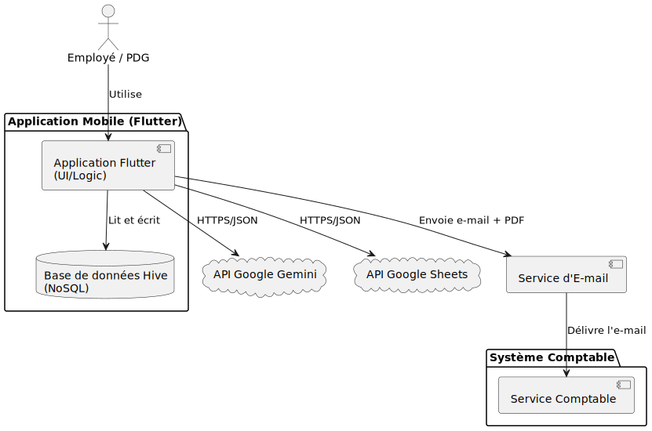
<figcaption>Figure 1.2 : Diagramme de Conteneurs C4 de l'application "Notes de Frais"</figcaption>
</figure>

<!-- Insérer ici une capture d'écran de l'interface principale -->
<figure>
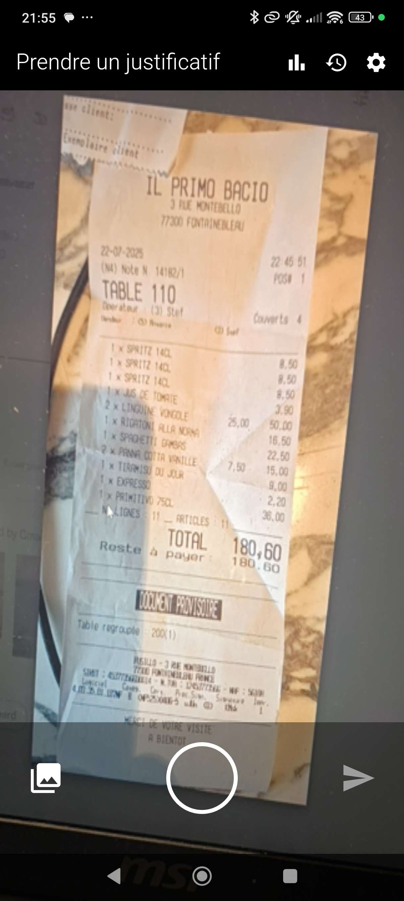
<figcaption>Interface de l'application "Notes de Frais"</figcaption>
</figure>

#### Captures complémentaires — Application Employé

  <figure class="mobile-shot">
    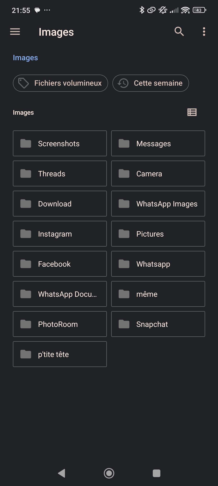
    <figcaption>Capture — Écran de capture/import de justificatifs (caméra ou sélecteur multi‑fichiers).</figcaption>
  </figure>
  <figure class="mobile-shot">
    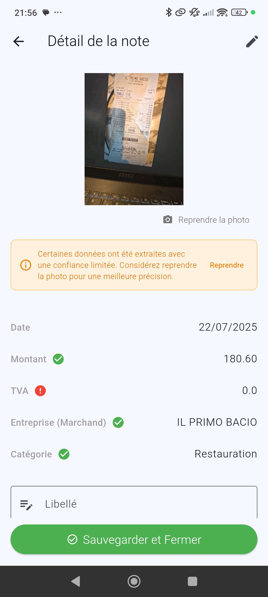
    <figcaption>Capture — Analyse IA et vérification/correction des données extraites (marchand, date, montant, TVA, indicateurs de confiance).</figcaption>
  </figure>
  <figure class="mobile-shot">
    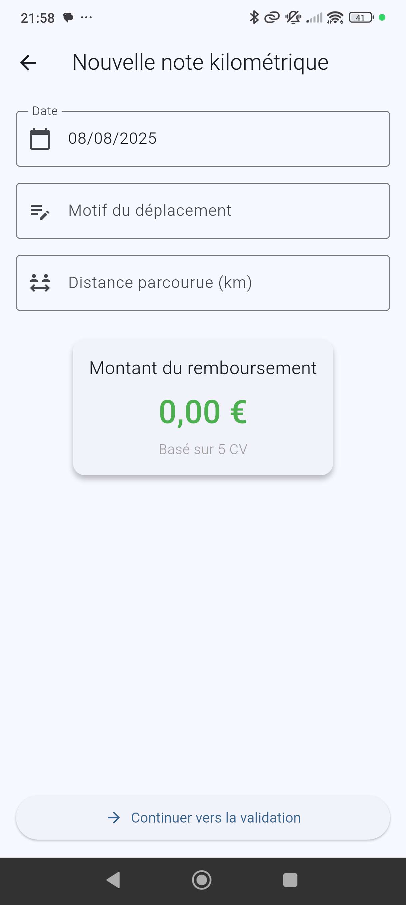
    <figcaption>Capture — Notes kilométriques (distance, barème, calcul et récapitulatif).</figcaption>
  </figure>
  <figure class="mobile-shot">
    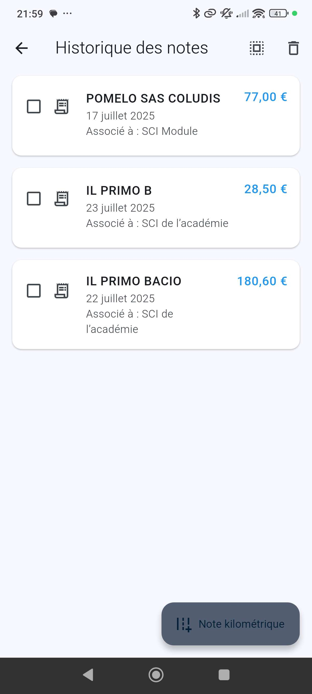
    <figcaption>Capture — Historique des notes (statuts envoyée/en attente, filtres).</figcaption>
  </figure>
  <figure class="mobile-shot">
    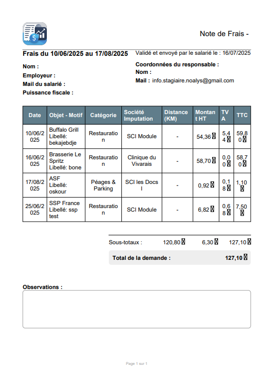
    <figcaption>Capture — Aperçu d'une page du PDF généré (tableau, totaux HT/TVA/TTC, logo).</figcaption>
  </figure>
  <figure class="mobile-shot">
    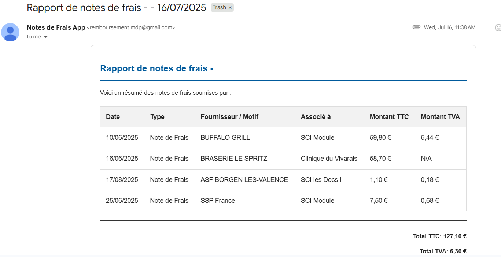
    <figcaption>Capture — Envoi et confirmation du rapport.</figcaption>
  </figure>

### Fonctions Clés Issues du Code

- `lib/services/ai_service.dart::extractExpenseDataFromFiles` : appel à Google Gemini avec prompt structuré, extraction JSON et indices de confiance.
- `lib/services/pdf_service.dart::generateExpenseReportPdf` : génération d’un PDF A4 (tables, totaux HT/TVA/TTC, polices embarquées, logo, sections d’observations).
- `lib/services/email_service.dart::sendExpenseBatchEmail` : envoi HTML avec PJ (PDF récap + justificatifs renommés), objet et CC salarié.
- `lib/services/background_task_service.dart::processQueue` : écoute réseau, reprise des envois, nettoyage fichiers, marquage `isSent`.
- `lib/views/camera_view.dart` : cycle de vie caméra, capture/import multi‑fichiers, navigation vers traitement.

### Difficultés Rencontrées

La principale difficulté de ce projet a été **l'apprentissage en totale autonomie du framework Flutter et du langage Dart**. Cela a nécessité un investissement initial important pour comprendre les concepts de widgets, de gestion d'état et l'écosystème de publication.

Une autre difficulté a été la gestion du **traitement asynchrone** pour l'envoi des e-mails, afin que l'application reste fluide et puisse gérer les envois même en cas de connectivité réseau intermittente.

### Résultats Obtenus

L'application développée est fonctionnelle et répond à toutes les exigences du cahier des charges. Elle a été testée par plusieurs utilisateurs (Benoit Gonnet, Philippe NERI) qui ont salué sa simplicité d'utilisation et le gain de temps réalisé. Le processus de soumission d'une note de frais, qui prenait auparavant plusieurs minutes de saisie manuelle, est désormais réalisable en moins d'une minute.

---

## Développement – Chapitre 2 : Application Mobile "Notes de Frais PDG"

### Analyse du Besoin Spécifique

Une version de l'application a été spécifiquement demandée pour les dirigeants de l'entreprise. Bien que partageant 90% des fonctionnalités de la version "Employé", elle devait intégrer une fonctionnalité clé supplémentaire : **l'export des données vers une feuille de calcul Google Sheets partagée**, en plus de l'envoi par e-mail.

L'objectif était de permettre un suivi financier en temps réel et de faciliter l'agrégation des données à des fins de reporting.

### Adaptations et Fonctionnalités Clés

Le projet a donc consisté à dupliquer la base de code existante (via une branche Git distincte, `Switch`) et à y intégrer l'API Google Sheets.

*   **Authentification Google :** Mise en place d'un flux d'authentification OAuth 2.0 pour permettre à l'application d'accéder aux services Google au nom de l'utilisateur.
*   **API Google Sheets :** Utilisation des bibliothèques `googleapis` et `googleapis_auth` pour écrire une nouvelle ligne dans un Google Sheet spécifié à chaque note de frais validée.

Le reste de l'application (capture, analyse IA, stockage local) est resté identique, garantissant une maintenance aisée des deux versions.

#### Captures d'écran — Application PDG

<figure>
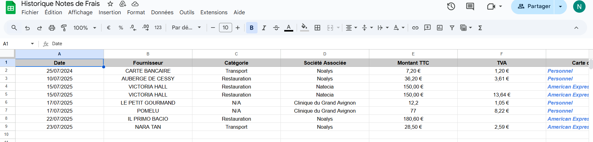
<figcaption>Capture — Résultat d'export : ligne ajoutée dans Google Sheets (toutes les colonnes pertinentes renseignées).</figcaption>
</figure>

### Résultats

La version "PDG" est également fonctionnelle. L'intégration avec Google Sheets apporte une plus-value significative en termes de suivi et d'analyse des dépenses, offrant une vision consolidée et instantanée qui n'existait pas auparavant.

---

## Développement – Chapitre 3 : Application Desktop "Gestion des Remboursements"

### Analyse du Besoin

Le troisième projet adressait une problématique différente : la gestion des demandes de remboursement de trop-perçus clients. Ce processus, critique pour la satisfaction client et la rigueur comptable, était entièrement géré par e-mail, ce qui entraînait des retards et un manque de visibilité.

Le besoin était de créer une application de bureau centralisée, avec :
*   Une gestion des utilisateurs basée sur des rôles (Demandeur, Comptable, Validateur, etc.).
*   Un workflow de validation en plusieurs étapes.
*   La possibilité de joindre des documents (RIB, facture).
*   Un historique complet et immuable de chaque demande.
*   Une base de données unique, partagée et accessible depuis un lecteur réseau.

### Architecture Logicielle MVC

Pour garantir la maintenabilité et la scalabilité de l'application, une architecture **Modèle-Vue-Contrôleur (MVC)** a été mise en œuvre.

#### Figure 2 : Schéma d'architecture de l'application "Gestion des Remboursements"
<figure>
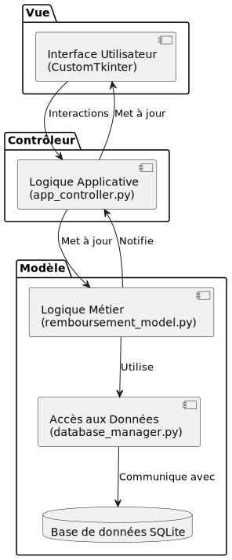
<figcaption>Figure 2 : Schéma d'architecture de l'application "Gestion des Remboursements"</figcaption>
</figure>
*   **Modèle :** Gère les données et la logique métier. Il interagit directement avec la base de données SQLite.
*   **Vue :** Responsable de l'affichage de l'interface graphique. Elle est construite avec la bibliothèque Python `CustomTkinter`.
*   **Contrôleur :** Reçoit les actions de l'utilisateur depuis la Vue, les traite en faisant appel au Modèle, et met à jour la Vue en conséquence.

#### Figure 2.1 : Diagramme de Contexte C4 de l'application "Gestion des Remboursements"
<figure>
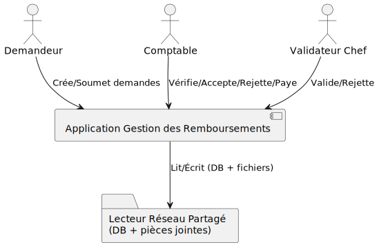
<figcaption>Figure 2.1 : Diagramme de Contexte C4 de l'application "Gestion des Remboursements"</figcaption>
</figure>

#### Figure 2.2 : Diagramme de Conteneurs C4 de l'application "Gestion des Remboursements"
<figure>
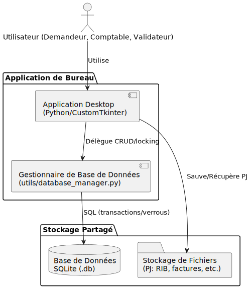
<figcaption>Figure 2.2 : Diagramme de Conteneurs C4 de l'application "Gestion des Remboursements"</figcaption>
</figure>

### Fonctions Clés Issues du Code

- `models/remboursement_model.py::creer_nouvelle_demande` : création demande, organisation des pièces (RIB/Facture/TP), historique initial.
- `models/remboursement_workflow.py` : transitions (accepter/refuser constat, valider/refuser, confirmer paiement, resoumission) avec historisation.
- `models/remboursement_data.py::charger_demandes_data` : filtrage multi‑critères, pagination, reconstruction modèle + historiques + PJ.
- `controllers/remboursement_controller.py` : pont UI/métier, copie versionnée des PJ, extraction d’archive ZIP à la volée, actions admin.
- `controllers/app_controller.py` : cycle de vie app, cache utilisateurs, tâches de démarrage (archivage, sauvegarde), bannière réseau, vérifs BDD.

### Fonctionnement et Workflow de Validation

L'application matérialise un processus métier strict où une demande de remboursement passe par plusieurs statuts, chaque transition étant conditionnée par l'action d'un utilisateur avec le rôle approprié.

#### Figure 3 : Diagramme du workflow de validation des remboursements
<figure>
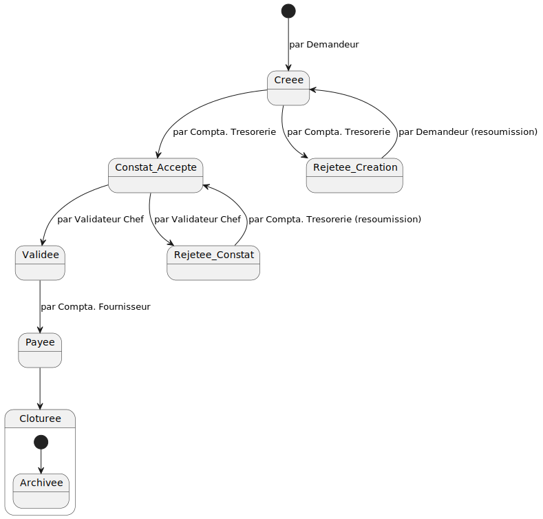
<figcaption>Figure 3 : Diagramme du workflow de validation des remboursements</figcaption>
</figure>
*Ce diagramme illustre les différents états d'une demande et les rôles habilités à la faire transiter d'un état à l'autre.*

<!-- Insérer ici une capture d'écran du tableau de bord principal de l'application -->
<figure>

<figcaption>Tableau de bord des demandes</figcaption>
</figure>

#### Captures complémentaires — Application Desktop

> À insérer — Écran de connexion  
> Fichier recommandé : `./captures/remboursement_login.png`  
> Contenu attendu : écran d'identification avec champs utilisateur/mot de passe et messages d'erreur éventuels.

<!-- 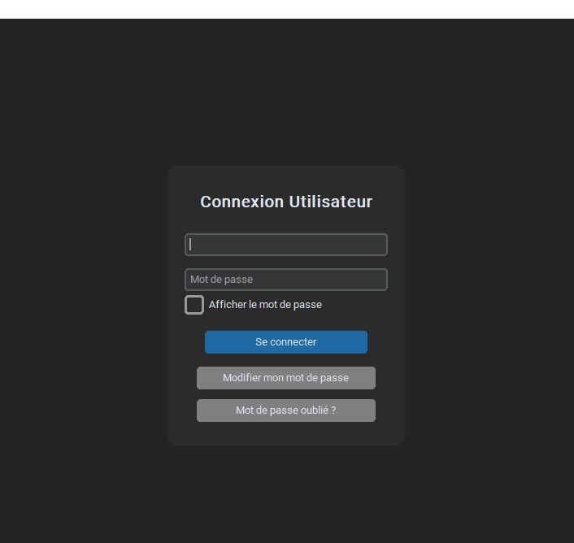 -->

> À insérer — Création d'une nouvelle demande  
> Fichier recommandé : `./captures/remboursement_new_request.png`  
> Contenu attendu : formulaire de création, champs principaux (identité, montant, motif).

<!-- 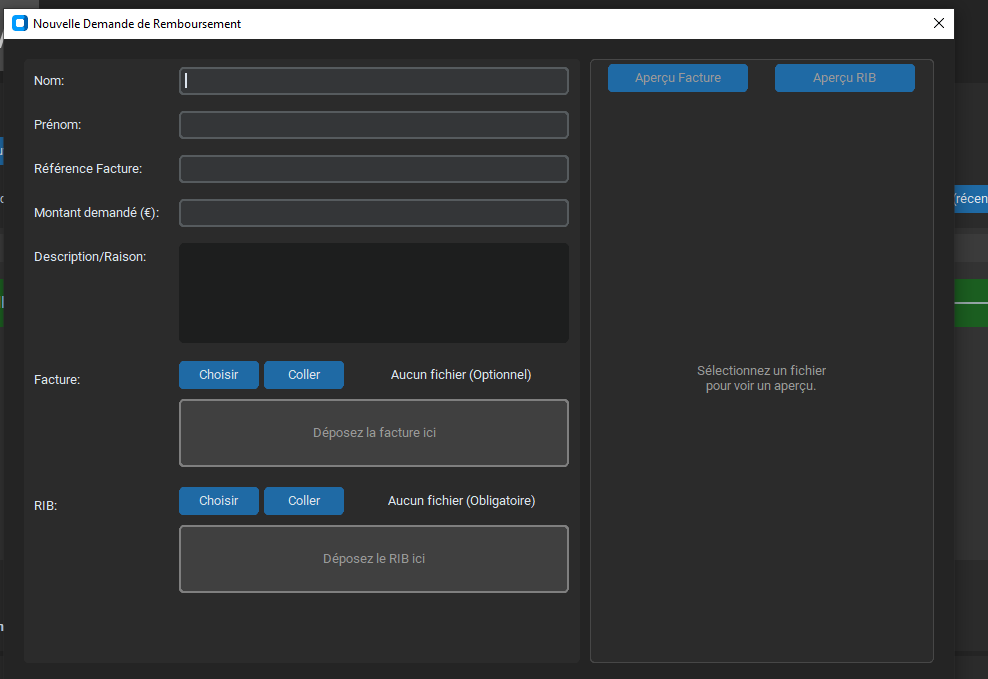 -->

> À insérer — Détails d'une demande  
> Fichier recommandé : `./captures/remboursement_details.png`  
> Contenu attendu : vue détaillée (historique, pièces jointes, statut).

<!--  -->

> À insérer — Pièces jointes (RIB, facture)  
> Fichier recommandé : `./captures/remboursement_attach_files.png`  
> Contenu attendu : interface d'ajout/visualisation des fichiers.

<!-- 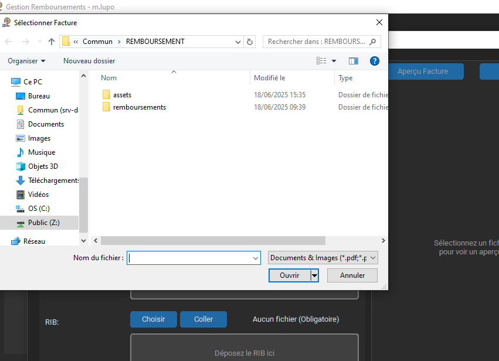 -->

> À insérer — Étape de validation par rôle  
> Fichier recommandé : `./captures/remboursement_role_validation.png`  
> Contenu attendu : action de validation/refus par un rôle (Comptable/Valideur), messages d'état.

<!--  -->

> À insérer — Confirmation de paiement  
> Fichier recommandé : `./captures/remboursement_payment_confirm.png`  
> Contenu attendu : transition finale avec confirmation et horodatage.

<!-- 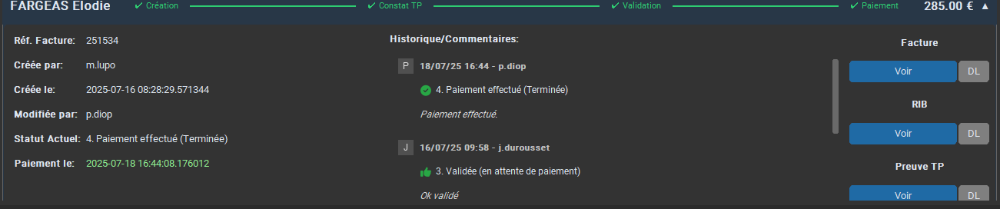 -->

### Gestion de la Base de Données sur Réseau

Une contrainte forte du projet était l'utilisation d'une base de données **SQLite locale, mais située sur un disque réseau partagé** pour être accessible par tous les utilisateurs. Cette contrainte a introduit des défis de performance et de concurrence d'accès. Des mécanismes de `verrouillage de fichier` (file locking) et une gestion rigoureuse des transactions ont été mis en place dans le `database_manager.py` pour éviter la corruption de la base de données lorsque plusieurs utilisateurs effectuent des opérations simultanément.

### Résultats Obtenus

L'application a été déployée et est utilisée par les différents services concernés (Marie LUPO, Pascale DIOP). Elle a permis de :
*   **Standardiser** le processus de demande de remboursement.
*   **Réduire de plus de 50%** le temps de traitement moyen d'une demande.
*   **Garantir une traçabilité complète** de toutes les actions.
*   **Centraliser** tous les documents et informations en un seul point.

---

## Conclusion

### Récapitulatif des Livrables

Ce stage a abouti à la livraison de trois applications entièrement fonctionnelles qui répondent aux problématiques de gestion initiales de Natécia :
1.  **Une application mobile "Notes de Frais"** pour les employés.
2.  **Une version "PDG"** de cette application avec des fonctionnalités de reporting étendues.
3.  **Une application de bureau "Gestion des Remboursements"** pour centraliser et sécuriser le workflow de validation.

Ces outils ont été conçus pour être robustes, sécurisés et évolutifs.

### Limites et Perspectives d'Évolution

Bien que fonctionnels, les projets présentent des axes d'amélioration :
*   **Synchronisation Cloud :** Pour les applications mobiles, une synchronisation des données (historique) sur un service Cloud permettrait à l'utilisateur de retrouver ses données en changeant de téléphone.
*   **Déploiement centralisé :** Pour l'application de bureau, un mécanisme de mise à jour automatique simplifierait la maintenance.
*   **Tests Unitaires :** Le développement de suites de tests unitaires et d'intégration plus complètes permettrait de renforcer la fiabilité du code.
*   **Serveur distant :** À terme, la migration de la base de données SQLite vers un vrai serveur de base de données (PostgreSQL, MySQL) serait bénéfique pour les performances et la scalabilité.

---

## Remerciements

Je tiens à exprimer ma profonde gratitude à ma maître de stage, **Mme Juliette Durousset**, pour sa confiance, sa disponibilité et ses précieux conseils tout au long de cette période.

Je remercie également l'ensemble des collaborateurs qui ont contribué au succès de ces projets par leurs retours et leur participation aux phases de test, notamment **M. Benoit Gonnet**, **M. Philippe NERI**, **Mme Pascale DIOP** et **Mme Marie LUPO**.

Enfin, je remercie CPE Lyon de m'avoir offert l'opportunité de réaliser ce stage enrichissant qui a été une excellente introduction au monde professionnel de l'ingénierie logicielle.

---

## Glossaire

*   **API :** Application Programming Interface. Interface de programmation applicative.
*   **Flutter :** Framework de développement d'interface utilisateur open-source créé par Google.
*   **Dart :** Langage de programmation optimisé pour le développement d'applications sur de multiples plateformes.
*   **Gemini :** Famille de modèles d'IA multimodaux développée par Google.
*   **Hive :** Base de données NoSQL clé-valeur, légère et rapide, écrite en Dart.
*   **MVC :** Modèle-Vue-Contrôleur. Patron d'architecture logicielle.
*   **OCR :** Optical Character Recognition. Reconnaissance optique de caractères.
*   **SQLite :** Système de gestion de base de données relationnelle contenu dans une bibliothèque C.

---

## Bibliographie

*   Documentation officielle de Flutter : [https://flutter.dev/docs](https://flutter.dev/docs)
*   Documentation de l'API Google Gemini : [https://ai.google.dev/docs](https://ai.google.dev/docs)
*   Documentation de la bibliothèque Python CustomTkinter : [https://customtkinter.com/documentation](https://customtkinter.com/documentation)
*   Documentation de la base de données Hive pour Flutter : [https://docs.hivedb.dev/](https://docs.hivedb.dev/)

---

## Annexes

### Liens vers les dépôts de code source

*   **Projet Notes de Frais (Employé & PDG) :** [https://github.com/Maxenss-Bonnet/notes_de_frais](https://github.com/Maxenss-Bonnet/notes_de_frais)
    *   Branche Employé : `Employer`
    *   Branche PDG : `Switch`
*   **Projet Gestion des Remboursements :** [https://github.com/Maxenss-Bonnet/Remboursement/tree/Main](https://github.com/Maxenss-Bonnet/Remboursement/tree/Main)

<!--

### Captures d'écran à insérer
*   Logos (page de garde) : `./captures/Logo_CPE.jpg`, `./captures/Logo_Natecia.png`
*   Présentation (optionnel) : `./captures/natecia_site_home.png`
*   Application Employé (Notes de Frais)
    * `./captures/ndf_main.png`
    * `./captures/ndf_capture.png`
    * `./captures/ndf_ai_review.png`
    * `./captures/ndf_km.png`
    * `./captures/ndf_history.png`
    * `./captures/ndf_pdf_sample.png`
    * `./captures/ndf_send.png`
*   Application PDG
    * `./captures/pdg_sheets_row.png`
*   Application Desktop (Remboursements)
    * `./captures/remboursement_login.png`
    * `./captures/remboursement_dashboard.png`
    * `./captures/remboursement_new_request.png`
    * `./captures/remboursement_details.png`
    * `./captures/remboursement_attach_files.png`
    * `./captures/remboursement_role_validation.png`
    * `./captures/remboursement_payment_confirm.png`
-->